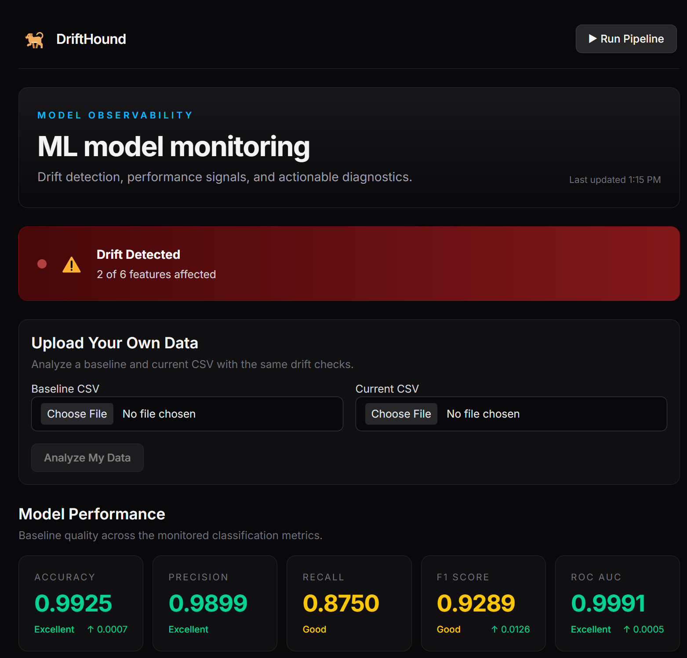
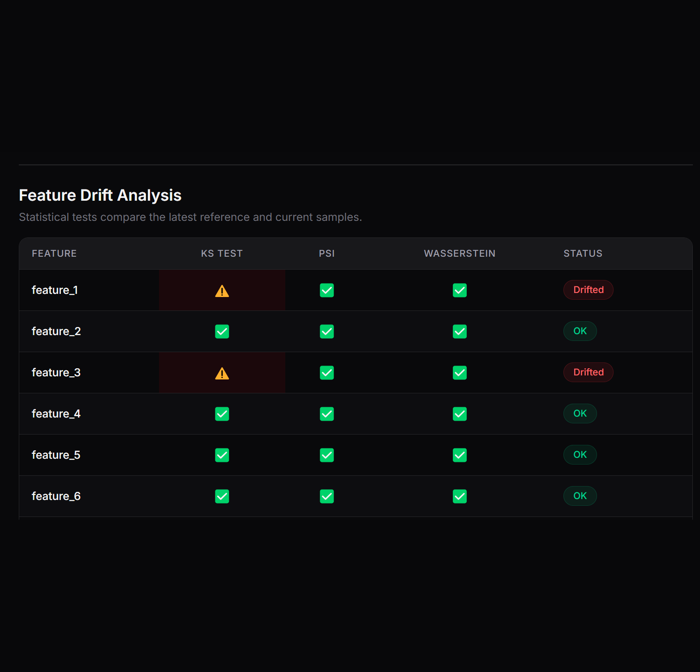
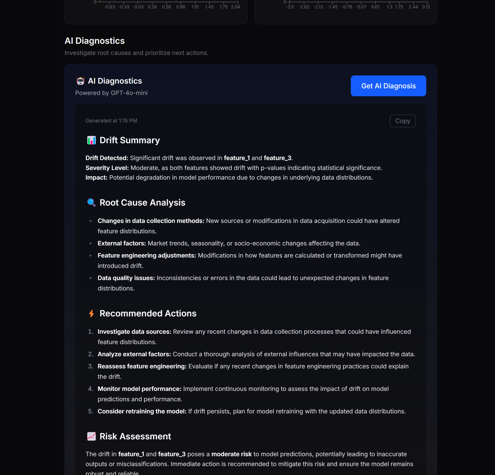

# 🐕‍🦺 DriftHound

**ML model monitoring — drift detection, performance signals, and actionable diagnostics.**

Point it at a baseline and a current dataset. DriftHound tells you what drifted, how bad it is, and what to do about it — in plain English, not just p-values.

   

**Live app:** [drift-hound.vercel.app](https://drift-hound.vercel.app)
**API docs:** [drifthound-baf0314d.fastapicloud.dev/docs](https://drifthound-baf0314d.fastapicloud.dev/docs)

---

## 📸 Demo

Two ways to use it:

- **▶ Run Pipeline** — generates a fresh synthetic baseline and current dataset on the fly, trains a baseline classifier, runs full drift detection, and populates the whole dashboard in one click. No setup needed.
- **📤 Upload Your Own Data** — drop in your own `baseline.csv` and `current.csv` (matching the expected feature columns) and get the exact same drift analysis run against your real data instead of synthetic samples.



---

## 🧠 What This Is

A model that looks healthy on paper can quietly degrade in production while nobody notices — because the *data* feeding it has shifted, not the model itself. DriftHound is a small, self-contained tool for catching that shift early, with three things most drift-monitoring demos skip:

1. **Multiple independent statistical tests**, not just one — so a single noisy metric doesn't drive a false alarm (or a missed one).
2. **A real upload path**, not just synthetic data — you can test it against your own CSVs, not only a canned demo.
3. **An LLM diagnostic layer on top of the raw stats** — turning "KS statistic: 0.0325, p-value: 5.17e-05" into an actual explanation of what probably happened and what to do next.

---

## 📊 How Drift Detection Works

Each feature in the current dataset is compared against the baseline using three independent tests:

| Test | What it measures |
|---|---|
| **KS Test** (Kolmogorov–Smirnov) | Whether the two distributions differ in shape |
| **PSI** (Population Stability Index) | How much a distribution has shifted, in a single interpretable score |
| **Wasserstein Distance** | The "cost" of transforming one distribution into the other |

**Decision rule:** if *any one* of the three tests flags drift, the feature is marked **Drifted**. Only if all three agree "no drift" is it marked **OK**. This favors catching real drift over reducing false positives — appropriate for a monitoring tool where a missed alert is worse than an extra one.



---

## 🤖 AI Diagnostics

Once drift is detected, DriftHound sends the raw statistical report to **GPT-4o-mini** and asks for a structured breakdown:

- **📊 Drift Summary** — what drifted, how severe, and the likely impact
- **🔍 Root Cause Analysis** — ranked, plausible explanations (data pipeline changes, seasonality, feature engineering bugs, etc.)
- **⚡ Recommended Actions** — a prioritized checklist, not a wall of text
- **📈 Risk Assessment** — what this means for the model's predictions if left unaddressed



---

## 🏗️ How It Works

```
Baseline CSV/Parquet ──┐
                        ├──► DriftMonitor ──► KS / PSI / Wasserstein per feature
Current CSV/Parquet ────┘            │
                                      ▼
                          Drift report (JSON) ──► GPT-4o-mini ──► Structured diagnosis
                                      │
                                      ▼
                     FastAPI backend ──► Next.js dashboard (charts, table, metrics)
```

Two entry points feed the same pipeline:
- **`/api/run-pipeline`** generates synthetic data internally (`generate_baseline_data` + `inject_drift`), trains a baseline classifier, and runs the full drift check.
- **`/api/upload-data`** accepts two user-supplied CSVs (validated against the expected feature columns), skips synthetic generation, and runs the identical `DriftMonitor` logic against real data.

---

## 🛠️ Tech Stack

**Backend**
- [FastAPI](https://fastapi.tiangolo.com/) — API framework
- [scikit-learn](https://scikit-learn.org/) — baseline classifier, model metrics
- [SciPy](https://scipy.org/) — statistical test implementations
- [pandas](https://pandas.pydata.org/) / [PyArrow](https://arrow.apache.org/docs/python/) — data handling, Parquet I/O
- [OpenAI](https://platform.openai.com/) (GPT-4o-mini) — AI diagnosis
- [joblib](https://joblib.readthedocs.io/) — model persistence

**Frontend**
- [Next.js](https://nextjs.org/) + [React](https://react.dev/)
- [Tailwind CSS](https://tailwindcss.com/) + [Typography plugin](https://tailwindcss.com/docs/typography-plugin)
- [Recharts](https://recharts.org/) — distribution charts
- [react-markdown](https://github.com/remarkjs/react-markdown) — renders the AI diagnosis output

**Infrastructure**
- Backend hosted on [FastAPI Cloud](https://fastapicloud.com)
- Frontend hosted on [Vercel](https://vercel.com)

---

## 📂 Project Structure

```
drifthound/
│
├── api/
│   └── server.py            # FastAPI app — all routes, CORS config
│
├── agent/                   # OpenAI client + diagnostic logic
│   ├── client.py
│   └── diagnostician.py
│
├── core/                    # Drift detector math (KS, PSI, Wasserstein)
│   └── drift_detectors.py
│
├── drift/                   # Monitoring orchestration + alerting
│   ├── monitor.py
│   └── alerts.py
│
├── data/                    # Synthetic data generation + ingestion pipeline
│   └── generators/synthetic_data.py
│
├── models/                  # Baseline training, evaluation, persistence
│   ├── baseline.py
│   ├── trainer.py
│   └── evaluator.py
│
├── config/
│   └── settings.py          # Paths, feature columns, thresholds
│
├── frontend/                # Next.js dashboard
│   └── src/
│       ├── app/page.tsx
│       └── components/
│           ├── upload-panel.tsx
│           ├── drift-table.tsx
│           ├── distribution-chart.tsx
│           ├── metrics-cards.tsx
│           ├── diagnosis-panel.tsx
│           ├── status-banner.tsx
│           └── run-pipeline-button.tsx
│
├── tests/                   # pytest suite
├── run_pipeline.py          # Standalone CLI entry point (Phases 1–4)
├── main.py                  # FastAPI Cloud entrypoint (imports api.server:app)
└── requirements.txt
```

---

## 🔌 API Reference

| Method | Route | Description | Needs `OPENAI_API_KEY` |
|---|---|---|---|
| `GET` | `/` | Health check | No |
| `GET` | `/api/status` | Which pipeline phases have completed | No |
| `GET` | `/api/drift-report` | Most recent drift report | No |
| `GET` | `/api/metrics` | Baseline model metrics | No |
| `GET` | `/api/metrics/comparison` | Baseline vs. current metrics | No |
| `POST` | `/api/run-pipeline` | Generate synthetic data + run full pipeline | No |
| `POST` | `/api/upload-data` | Upload baseline/current CSVs, run drift check | No |
| `GET` | `/api/feature-distributions` | Sampled values per feature for charting | No |
| `POST` | `/api/diagnose` | AI diagnosis of the current drift report | **Yes** |

Full interactive docs: `/docs` on the backend URL.

---

## 🚀 Getting Started

```bash
git clone https://github.com/HoorShumail/DriftHound.git
cd DriftHound
```

**Backend:**
```bash
python -m venv .venv
source .venv/bin/activate      # or .venv\Scripts\Activate.ps1 on Windows
pip install -r requirements.txt
uvicorn api.server:app --reload --port 8000
```

**Frontend** (in a second terminal):
```bash
cd frontend
npm install
npm run dev
```

Open `http://localhost:3000`.

**For AI diagnosis**, create a `.env` file in the project root:
```env
OPENAI_API_KEY=your_key_here
```

**To test the upload feature**, prepare two CSVs with matching columns (`feature_1` through `feature_6`) and use the **Upload Your Own Data** panel on the dashboard.

---

## ⚠️ Honest Limitations

- **Synthetic runs aren't seeded.** `/api/run-pipeline` generates fresh random data on every call, so which features show as "drifted" can vary run to run — occasionally more features trigger than the two intentionally drifted, due to PSI/Wasserstein threshold sensitivity on random noise. This is expected variance, not a detection bug, but it does mean back-to-back demo runs won't always look identical.
- **Feature columns are currently hardcoded.** Uploaded CSVs must match `FEATURE_COLUMNS` exactly (`feature_1`–`feature_6`) — arbitrary schemas aren't yet supported. A mismatch returns a clear 400 error rather than a silent failure.
- **Free-tier hosting trade-offs.** The backend (FastAPI Cloud free tier) can take 30–50 seconds to respond after a period of inactivity while it wakes up — expected cold-start behavior, not downtime.
- **No authentication.** This is a demo/portfolio deployment — anyone with the URL can run the pipeline or upload data. Not intended for production use as-is.

---

## 🧑‍💻 Author

**Hoor Shumail**
AI | Agentic AI | Machine Learning | Computer Vision

- GitHub: [github.com/HoorShumail](https://github.com/HoorShumail)
- LinkedIn: [linkedin.com/in/hoor-shumail-a3a076326](https://www.linkedin.com/in/hoor-shumail-a3a076326/)

## 📜 License

MIT — built for educational and portfolio purposes.